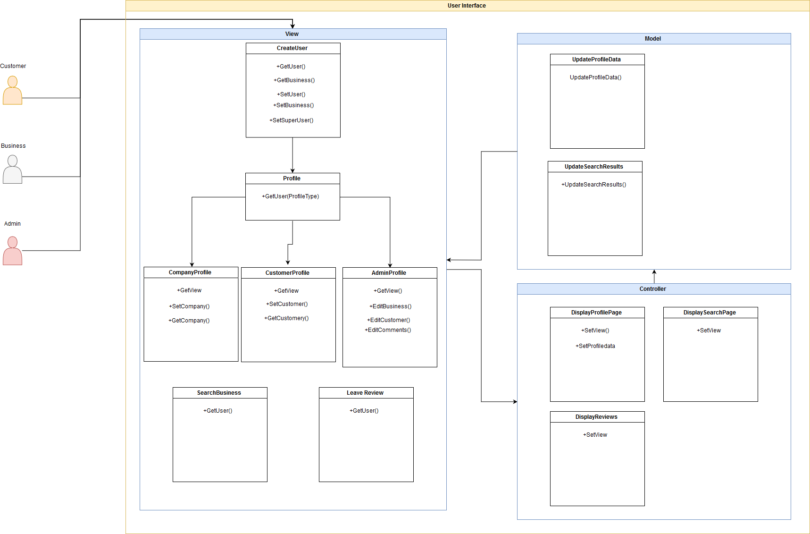
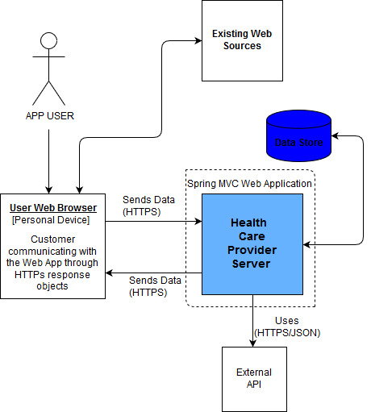
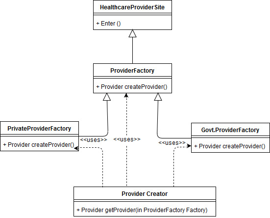
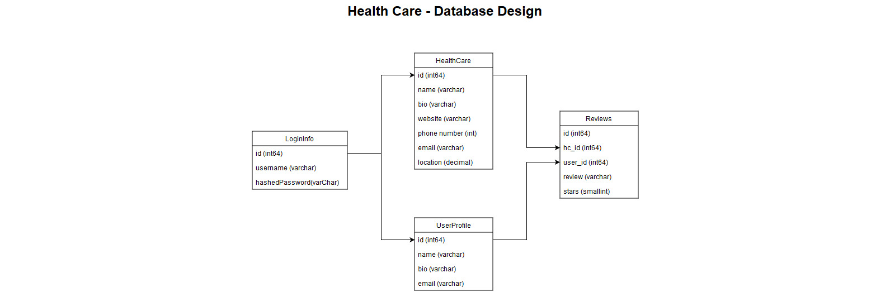

## Mission Statement
  Our mission statement is to provide individuals with enough information so that they can make an informed decision when choosing a healthcare professional.  The health and well-being of all people is very important to our team.  We want to provide a way that the community can share their experiences so that others can make decisions that are the best for them.

## Problem Statement
   It is difficult in the United States to easily find a doctor or specialist, especially one that is both accepted by your insurance provider and comes with a high recommendation by a trusted community.
   
## Team and Responsibility
* Nick Carmen - Engineer
* Gerardo Faia - Engineer
* Lakshmi Maguluri - Architect
* Shubhra Mahey - Architect

# Assignment 2

### Users:

- Customer - individuals who want to view different healthcare providers, rate them, and leave reviews
- Health Care Providers - individuals or organizations that want to share information about their services to a wider audience, this can be their location, hours, on-site staff, website etc.
- System admin - the owner of back-end infrastructure.  This person has the ability to moderate by changing or deleting accounts/comments/reviews

### Feature Set

| User | Feature Name | Description |
| --- | --- | --- |
| Customer | Create Account | As a customer, they will be able to create an account |
| Customer | Search | As a customer, they will be allowed to search for different health care professionals, health care providers, Health care establishments by name |
| Customer | Review | As a customer, they will be allowed to leave reviews of health care professionals, health care providers, Health care establishments |
| Health Care Providers | Add | Doctors and companies will be able to add their business to the website. |
| Health Care Providers | Create Account | Doctors and companies will be able to create a profile |
| Systems Admin | Manage Accounts | A system admin will be able have master control over all accounts and customers ratings |

## UI Diagram 

- The UI above shows how the MVC pattern will work within our application. The Customer, Business or SuperUser will be able to create an account which will then give them a profile. The Controller will trigger the different displays that the user will see and also tell the Model what data it needs to populate. The Model will display the data to the view. We chose this type of pattern because it allows us to easily separate the different components as the UI design get more complex.

## [Application Diagram](https://drive.google.com/file/d/1q7LKR04xSaLWcB6vnQTWxlQ9pp57ZU6f/view?usp=sharing)

- This is the Component Diagram of our application where the user uses the device (web/phone) to send a request to the Health Care Provider Server and access the Health care provider&#39;s data or send it&#39;s own data while registering. The server in turn sends a HTTP/JSON request to an external API to access the results to display the three best results in the app. All the health care provider&#39;s data and user&#39;s data is stored in the Data Store.The user web browser also interacts with the existing web sources. The Health Care Provider Server further has an MVC pattern.

## [UI - Abstract Factory Methods](https://drive.google.com/file/d/1lT39HgxnoIeXHqyfFEfIisYFTiYXyUdj/view?usp=sharing)

- The client may want to get results from the website depending on the specific type of healthcare provider.At the same time, the client does not need to know how and where exactly the object is created. Here, we implemented the Abstract Factory pattern that uses inheritance to create the specific type of healthcare provider and provides the results to the user. This pattern reduces the  dependency of our application on concrete classes.

## [Database Backend](https://drive.google.com/file/d/1f4NE4Giiy93wb0sdTH21UXn6m-6Hu78A/view?usp=sharing)

- This is a shared data store pattern with a partial star schema.  Due to the simplistic nature for a prototype, it is only a 2NF (2nd normalized form) however in later development, we may normalize the data further.  This is a shared data store pattern as all relevant information to the app will be stored in the databases and can be accessed through interacting with this layer, whether its account information, profiles or review information.
